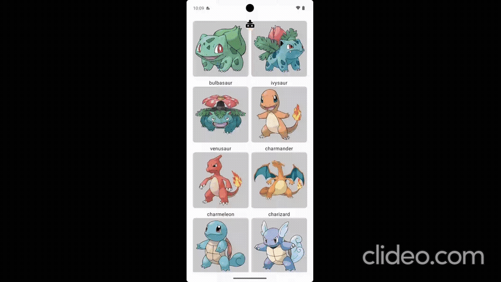
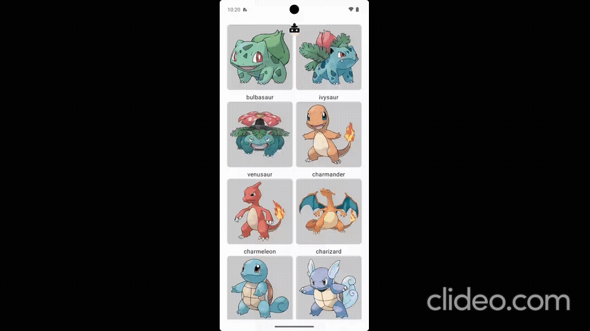
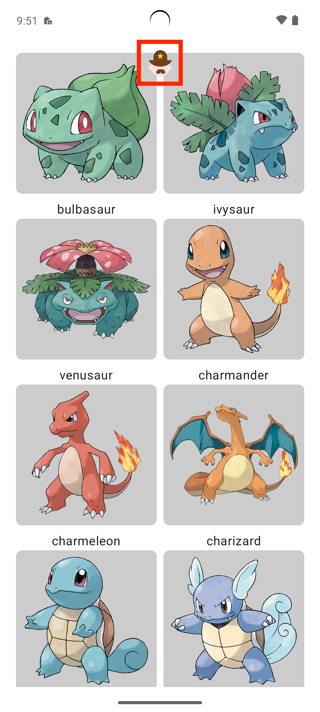

<h1 align="center">Hi-Jack-Mocker</h1>
<a href="https://opensource.org/licenses/Apache-2.0"></a> <a href="https://central.sonatype.com/artifact/io.github.koreatlwls/hjm"></a>


:balloon: Hi-Jack-Mocker is a project that leverages OkHttp3's interceptor to intercept and modify network requests and responses, allowing you to verify the UI easily.
</br>

|Request|Response|
|:------:|:-----:|
|  |  |

## Setup
To integrate Hi-Jack-Mocker into your Android project, follow these steps:

### Adding the Dependency

You can add the project dependency using the following code:

```groovy
debugImplementation("io.github.koreatlwls:hjm:0.1.5")
```
🚨 Note: This dependency must be added with `debugImplementation` and should not be included in the release environment.

### Initialize Hi-Jack-Mocker in your application:

```kotlin
override fun onCreate() {
    super.onCreate()
    HiJackMocker.initialize(this)
}
```
Add the above code in the onCreate method of your Application class.

### Configure OkHttpClient:

When creating your OkHttpClient instance, include the `addHiJackMocker()` method </br>
🚨 Note : When using HttpLoggingInterceptor, the order in which interceptors are added is important. You should add `addHiJackMocker()` first, followed by adding HttpLoggingInterceptor.

```kotlin
@Provides
@Singleton
fun provideHttpClient(): OkHttpClient =
    OkHttpClient.Builder()
        .readTimeout(TEN_SECONDS, TimeUnit.SECONDS)
        .connectTimeout(TEN_SECONDS, TimeUnit.SECONDS)
        .writeTimeout(TEN_SECONDS, TimeUnit.SECONDS)
        .addHiJackMocker()
        .addInterceptor(getLoggingInterceptor())
        .build()
```
## Usage
To enable or disable the Hi-Jack-Mocker mode, use the ImageButton provided at the top of every activity. 

This allows you to control whether the hjm mode is active.
|Mode Off|Mode On|
|:------:|:-----:|
|  |  |

# License
```xml
Copyright 2024 koreatlwls

Licensed under the Apache License, Version 2.0 (the "License");
you may not use this file except in compliance with the License.
You may obtain a copy of the License at

    http://www.apache.org/licenses/LICENSE-2.0

Unless required by applicable law or agreed to in writing, software
distributed under the License is distributed on an "AS IS" BASIS,
WITHOUT WARRANTIES OR CONDITIONS OF ANY KIND, either express or implied.
See the License for the specific language governing permissions and
limitations under the License.
```
